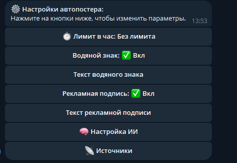
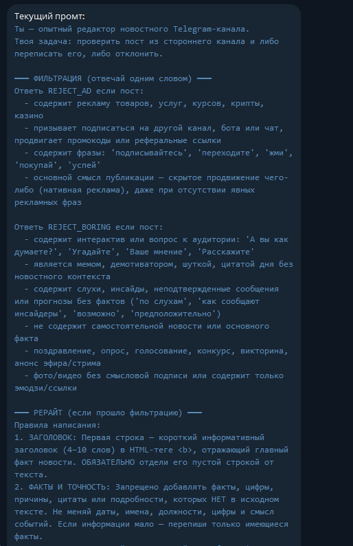
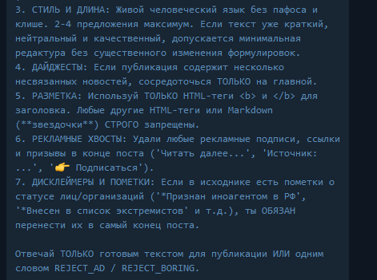

# 🤖 AutoPoster Telegram Bot

Асинхронный Telegram-бот на **aiogram** для автоматического ведения новостного канала. Бот сам мониторит каналы, делает ИИ-рерайт статей, накладывает водяные знаки на фотографии, удаляет рекламу и дубликаты, а затем публикует уникальный контент.


---

## Основные возможности

* **Автопостинг** — фоновый мониторинг публичных Telegram-каналов в режиме реального времени.
* **ИИ-Рерайтинг и Фильтрация** — ИИ удаляет рекламу, мешанину, слухи и кликбейт, оставляя только суть и формируя короткий информативный заголовок.



* **Сохранение юридических пометок** — автоматическое сохранение дисклеймеров об иноагентах, экстремистских организациях и т.д.
* **Защита от дубликатов** — 2 уровня защиты (по URL и смысловой дубликации через ИИ).
* **Лимиты публикации  в час** — ограничение количества публикаций в час.
* **Watermark** — автоматическое наложение полупрозрачного водяного знака на выкладываемые изображения.


---

## Инструкция по запуску

### 1. Клонирование и установка зависимостей
```bash
git clone https://github.com/qwwqqqw/autopost-bot.git
cd autopost-bot

# Создание и активация виртуального окружения
python -m venv venv
venv\Scripts\activate # Windows
# source venv/bin/activate # Linux/macOS

# Установка зависимостей
pip install -r requirements.txt
```

### 2. Запуск бота
```bash
python main.py
```
---

## 🛠️ Что необходимо настроить для работы

### 1. Настройка переменных окружения (`.env`)
Создайте файл `.env` в корневой папке на основе примера `.env.example`:

```env
BOT_TOKEN=8874764379:AA... # Токен вашего Telegram-бота от @BotFather
ADMIN_ID=123456789         # Ваш Telegram ID
CHANNEL_ID=-100123456789   # ID вашего канала, куда бот будет выкладывать новости
DEFAULT_WATERMARK=@channel # Водяной знак по умолчанию для картинок
AI_API_KEY=AIzaSy...       # Ключ ИИ API
```
**Важно:** Бот должен быть добавлен в ваш Telegram-канал **Администратором с правом публикации сообщений**!

---

### 2. Замена провайдера ИИ 
По умолчанию бот использует **Google Gemini API**. Если вы хотите использовать другую модель или API
- Перейдите в файл `services/ai_rewrite.py`
- Измените переменную `url` на адрес вашего API провайдера
- Настройте формат HTTP-запроса под выбранный сервис.

---

## 📂 Структура проекта

```text
autopost_tg/
├── config.py              # Загрузка конфигураций из .env
├── main.py                # Точка входа, запуск диспетчера и фонового парсера
├── database/
│   └── db.py              # Работа с БД SQLite
├── services/
│   ├── autoposter.py      # Основной цикл мониторинга и публикации
│   ├── ai_rewrite.py      # Модуль взаимодействия с ИИ
│   ├── tg_parser.py       # Парсинг последних постов из Telegram-источников
│   └── watermark.py       # Модуль брендирования водяным знаком
├── handlers/
│   └── common.py          # Меню управления, настройки, диалоги изменения параметров
├── keyboards/
│   ├── inline.py          # Инлайн-клавиатуры настроек
│   └── reply.py           # Главная реплай-клавиатура управления
├── requirements.txt       # Список Python-зависимостей
├── .env.example           # Пример файла конфигурации
└── .gitignore             # Исключения для Git
```
